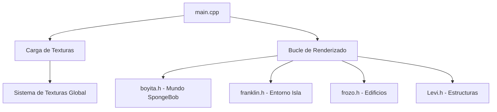

# 🧽 BobitoEsponja - Mundo 3D de Bob Esponja

Una aplicación 3D interactiva desarrollada en OpenGL que recrea el icónico mundo submarino de Bob Esponja con gráficos detallados y animaciones.

## 🌊 Características

- **Mundo 3D Completo**: Recreación detallada de Fondo de Bikini con casas icónicas, personajes y elementos del mar.
- **Personajes Animados**: Modelos 3D de Bob Esponja, Patricio, Calamardo y Plankton
- **Elementos Interactivos**: Medusas con tentáculos animados y algas que se mueven con el tiempo 
- **Texturas Realistas**: Sistema de texturas para agua, arena, madera y elementos decorativos
- **Arquitectura Modular**: Cada desarrollador contribuyó con componentes específicos del mundo

## 🏗️ Arquitectura del Proyecto

### Componentes Principales

| Módulo | Archivo | Desarrollador | Contenido |
|--------|---------|---------------|-----------|
| **Universo de Bob Esponja** | `boyita.h` | Boyita | Casas, personajes, corales, medusas |
| **Entorno de Isla** | `franklin.h` | Franklin | Isla, agua, arena, palmeras |
| **Edificios y Personajes** | `frozo.h` | Frozo | Modelos adicionales, construcciones |
| **Componentes Estructurales** | `Levi.h` | Levi | Pilares, bases, elementos estructurales |

### Sistema de Renderizado



## 🛠️ Tecnologías Utilizadas

- **OpenGL**: Renderizado 3D y manejo de gráficos [7](#0-6) 
- **GLUT**: Manejo de ventanas y eventos
- **Visual Studio 2022**: Entorno de desarrollo con toolset v143 [8](#0-7) 
- **NuGet Packages**: 
  - `nupengl.core.0.1.0.1` - Funcionalidad core de OpenGL
  - `nupengl.core.redist.0.1.0.1` - Componentes redistribuibles [9](#0-8) 

## 🚀 Instalación y Configuración

### Prerrequisitos

- Visual Studio 2022 o compatible
- Windows 10 SDK
- Soporte para desarrollo en C++
- OpenGL drivers actualizados

### Pasos de Instalación

1. **Clonar el repositorio**
   ```bash
   git clone https://github.com/franklinnot/BobitoEsponja.git
   cd BobitoEsponja
   ```

2. **Abrir el proyecto**
   - Abrir `sem11_compugraph/sem11_compugraph/sem11_compugraph.vcxproj` en Visual Studio

3. **Restaurar paquetes NuGet**
   - Visual Studio restaurará automáticamente las dependencias de OpenGL

4. **Compilar y ejecutar**
   - Seleccionar configuración (Debug/Release) y plataforma (Win32/x64)
   - Presionar F5 para compilar y ejecutar

## 🎮 Uso

Una vez ejecutada la aplicación, podrás explorar el mundo 3D de Bob Esponja con:

- **Navegación**: Controles de cámara para explorar el mundo
- **Elementos Animados**: Observa las medusas y algas en movimiento
- **Detalles Visuales**: Texturas realistas en agua, arena y estructuras

## 🏛️ Estructura del Código

### Archivos Principales

- `main.cpp`: Punto de entrada y bucle principal de renderizado [10](#0-9) 
- `CodigoBase.h`: Utilidades base para gráficos
- `MetodosPoligonos.h`: Funciones para primitivas geométricas [11](#0-10) 
- `Texturas/RgbImage.h/.cpp`: Sistema de carga de texturas

### Módulos de Escena

Cada módulo es independiente y contribuye elementos específicos al mundo 3D:

- **Casas Icónicas**: Casa piña de Bob Esponja, roca de Patricio, casa de Calamardo
- **Personajes**: Modelos 3D detallados con características únicas
- **Flora Marina**: Corales, algas animadas, elementos decorativos
- **Entorno**: Isla, agua, arena, cielo, palmeras

## 🤝 Contribuciones

Este proyecto fue desarrollado colaborativamente por múltiples desarrolladores:

- **Franklin Not**: Entorno de isla y coordinación del proyecto
- **Boyita**: Universo de Bob Esponja y personajes principales  
- **Frozo**: Edificios adicionales y modelos de personajes
- **Levi360xd**: Componentes estructurales y elementos base

## 📝 Licencia

Este proyecto es de código abierto y está disponible bajo los términos especificados en el repositorio.

## 🎯 Características Técnicas

- **Configuraciones de Build**: Debug/Release para Win32 y x64 [12](#0-11) 
- **Sistema de Texturas**: Manejo automático de 100+ texturas
- **Animaciones**: Sistema basado en tiempo para elementos dinámicos
- **Renderizado Optimizado**: Uso eficiente de primitivas OpenGL

---

**¡Sumérgete en el mundo de Fondo de Bikini y explora esta recreación 3D del universo de Bob Esponja!** 🌊🧽

